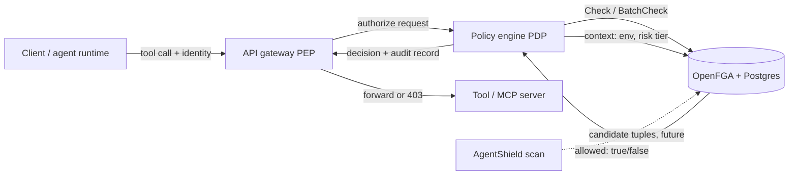

# OpenFGA for AI agent fine-grained authorization (issue #106)

Status: design note, no scanner changes. Date: 2026-09-10.

## Executive summary

OpenFGA is an Apache-2.0, Zanzibar-inspired relationship-based access control (ReBAC) engine. It stores `user, relation, object` tuples, evaluates them against a typed authorization model, and answers `Check`, `BatchCheck`, `ListObjects`, `ListUsers`, and `Expand` queries. It runs on PostgreSQL 14+ or MySQL 8 (SQLite is beta), ships official SDKs for Go, Node.js, Python, Java, and .NET, and has been used in production by Auth0 FGA since December 2021 (source: github.com/openfga/openfga README).

For the agent problem the issue describes (User to Agent, Agent to Tool/MCP server, Agent to Agent delegation, with conditions on risk tier and environment), ReBAC is the right shape. Conditions (CEL expressions) and contextual tuples cover the ABAC-flavored parts without a second policy language.

Recommendation: adopt OpenFGA as the ReBAC engine inside a Policy Decision Point (PDP) if and when AgentShield grows a runtime enforcement path. Nothing ships in the scanner now. The only near-term, low-cost item is documenting how a scan's allow-list and MCP inventory map to candidate tuples, so a future exporter has a stable contract.

## Why ReBAC fits the agent graph

The three relationships in scope are graph edges, not attribute predicates:

- User to Agent: "alice may run agent:deploy-bot" is a `user` related to an `agent` as `operator`. Team membership makes it transitive (`operator from team`).
- Agent to Tool / MCP server: "agent:deploy-bot may call tool:github.create_pr" is an `agent` related to a `tool` as `caller`. Tools group under an `mcp_server`, so a grant on the server can flow down to its tools via `from`.
- Agent to Agent delegation: "agent:planner may delegate to agent:executor" is an `agent` related to an `agent` as `delegate`. Because OpenFGA models this as a relation, the PDP can ask "does the delegate still have `can_invoke` on the tool" instead of trusting inherited scope. This is the exact gap the agentic-authz reference repo calls out: "Agents should not inherit broad human permissions just because they act on a human's behalf."

OpenFGA's docs describe ReBAC as "a superset of RBAC and natively covers ABAC scenarios when attributes are expressed as relationships" (openfga.dev/docs/authorization-concepts). Risk tier and environment are the residual attribute checks; conditions handle them.

## Architecture



The PEP only forwards identity and the requested tool operation. The PDP owns the mapping from request to `(user, relation, object, context)`, picks consistency, and writes the audit record. OpenFGA never sees prompts or payloads.

## Worked authorization model

```
model
  schema 1.1

type user

type team
  relations
    define member: [user]
    define lead: [user]

type agent
  relations
    define owner_team: [team]
    define operator: [user, team#member] or member from owner_team
    define delegate: [agent]
    define can_run: operator
    define can_delegate_to: delegate

type mcp_server
  relations
    define owner_team: [team]
    define allowed_agent: [agent] or delegate from allowed_agent
    define can_connect: allowed_agent

type tool
  relations
    define server: [mcp_server]
    define caller: [agent with env_and_tier_ok, agent]
    define approver: lead from server_owner_team
    define server_owner_team: owner_team from server
    define can_invoke: caller or can_connect from server

condition env_and_tier_ok(
  tuple_env: string, request_env: string,
  max_tier: int, request_tier: int
) {
  tuple_env == request_env && request_tier <= max_tier
}
```

Notes:

- `caller: [agent with env_and_tier_ok, agent]` lets a grant carry a condition (env and tier bounds stored with the tuple) or be unconditional. Persisted context on the tuple takes precedence over request context (openfga.dev/docs/modeling/conditions).
- `allowed_agent ... or delegate from allowed_agent` is how delegation flows: if `agent:planner` is allowed on a server and `agent:executor` is its delegate, executor can connect. The PDP should still require the delegating agent to exist as an explicit tuple; nothing here grants delegation implicitly.
- Data classification can be added the same way as tier: an `int classification` parameter compared against a tuple bound. UNVERIFIED: the model above has not been run through `fga model validate` or a `store test` file. Do that before anyone relies on it.

## Check and BatchCheck

Single check, with request context for the condition and a contextual tuple asserting the current session's team membership (limit is 100 contextual tuples per request):

```json
{
  "authorization_model_id": "01HVMMBCMGZNT3SED4Z17ECXCA",
  "tuple_key": {
    "user": "agent:deploy-bot",
    "relation": "can_invoke",
    "object": "tool:github.create_pr"
  },
  "context": { "request_env": "prod", "request_tier": 2 },
  "contextual_tuples": {
    "tuple_keys": [
      { "user": "user:alice", "relation": "member", "object": "team:platform" }
    ]
  },
  "consistency": "HIGHER_CONSISTENCY"
}
```

BatchCheck, used when a PDP pre-filters the tool list an agent is about to be offered (default max 50 checks per request; docs say it is less efficient than parallel `Check` below roughly 10 checks):

```json
{
  "authorization_model_id": "01HVMMBCMGZNT3SED4Z17ECXCA",
  "checks": [
    {
      "tuple_key": { "user": "agent:deploy-bot", "relation": "can_invoke", "object": "tool:github.create_pr" },
      "context": { "request_env": "prod", "request_tier": 2 },
      "correlation_id": "t1"
    },
    {
      "tuple_key": { "user": "agent:deploy-bot", "relation": "can_invoke", "object": "tool:postgres.query" },
      "context": { "request_env": "prod", "request_tier": 2 },
      "correlation_id": "t2"
    }
  ]
}
```

Consistency: `MINIMIZE_LATENCY` is the default and may serve from cache (caching is off by default). Use `HIGHER_CONSISTENCY` right after a tuple write, for example immediately after a revocation. `ListObjects` answers "which tools can this agent invoke" and is documented as suited to small collections, which matches a per-agent tool inventory.

## How AgentShield could feed this (future)

AgentShield already has the two inputs a tuple exporter needs:

- The scanned `permissions.allow` list and the parsed `mcpServers` map (`src/types.ts`, `McpConfigSchema`). Each allow-list entry maps to a candidate `tool` object and a `caller` tuple; each MCP server maps to an `mcp_server` object with its tools as children.
- `OrgPolicy` in `src/policy/types.ts` carries `banned_tools`, `banned_mcp_servers`, and `policy_pack`. Banned items should never become tuples; the exporter would emit them as an explicit exclusion list so a reviewer can diff intent against what the graph would grant.

Proposed shape, not built: a `agentshield.tuples.v1` JSON document alongside the existing `agentshield.policy-export.v1` manifest in `src/policy/export.ts`, containing candidate tuples, the source finding IDs, and the scan sha256. Candidate means a human writes them, not the scanner.

Second future item: `promotePolicyPack` in `src/policy/promote.ts` already emits review items before a pack is promoted. A later version could add an `action_required` item that fails unless a `Check(user:<promoter>, can_promote, policy_pack:<id>)` returns `allowed: true`. That keeps promotion authority in the same graph as agent authority. Evidence packs (`src/evidence-pack/index.ts`) would record the `authorization_model_id` and the check result.

## Comparison

Rows other than OpenFGA are from general knowledge of the projects and were not verified against their docs for this note (UNVERIFIED).

| Engine | Model | Conditions / attributes | Fit for agent graph | Notes |
|---|---|---|---|---|
| OpenFGA | Zanzibar ReBAC, DSL | CEL conditions, contextual tuples | Strong | CNCF project (UNVERIFIED from the README alone), Postgres/MySQL, five official SDKs |
| SpiceDB | Zanzibar ReBAC, schema language | Caveats (CEL) | Strong | Different schema syntax, own datastore options, commercial vendor Authzed |
| Ory Keto | Zanzibar ReBAC, OPL (TypeScript-like) | Limited | Medium | Smaller ecosystem, fewer condition features |
| Cedar | Policy language, RBAC/ABAC with entity hierarchy | Native | Medium | Policies rather than tuples; good for static rules, weaker for dynamic delegation graphs |
| OPA / Rego | General policy language | Native | Medium | Needs data pushed in; no built-in relationship graph or reverse queries |

## Pros and cons

Pros: relationship model matches the agent graph directly; delegation is one relation, not a policy rewrite; conditions cover env and tier without a second engine; `ListObjects` gives the "what can this agent touch" view for free; Apache-2.0 and self-hostable.

Cons: another stateful service (Postgres plus OpenFGA) to run; tuple hygiene becomes an operational duty, and stale grants are a new failure mode; the consistency knob is easy to get wrong after revocations; the reference repo is explicitly a demo ("not a drop-in authorization system for production"); AgentShield today is a static scanner with no runtime PEP, so there is nothing to enforce against yet.

## Recommendation

Adopt: OpenFGA as the ReBAC engine behind a PDP, when a runtime enforcement path exists. Model shape as above, validated with `fga model validate` and `store test` before use.

Defer: tuple export from scans, promotion gating on `Check`, and any SDK dependency in this repo. Track each as its own issue once a PEP exists.

Explicitly: nothing ships in the scanner now. This note closes #106 as research.

## References

- https://github.com/openfga/openfga
- https://openfga.dev/docs/modeling/getting-started
- https://openfga.dev/docs/modeling/conditions
- https://openfga.dev/docs/interacting/contextual-tuples
- https://openfga.dev/docs/interacting/relationship-queries
- https://openfga.dev/docs/interacting/consistency
- https://openfga.dev/docs/getting-started/perform-check
- https://openfga.dev/docs/authorization-concepts
- https://openfga.dev/docs/modeling/advanced/entitlements
- https://github.com/Siddhant-K-code/agentic-authz
